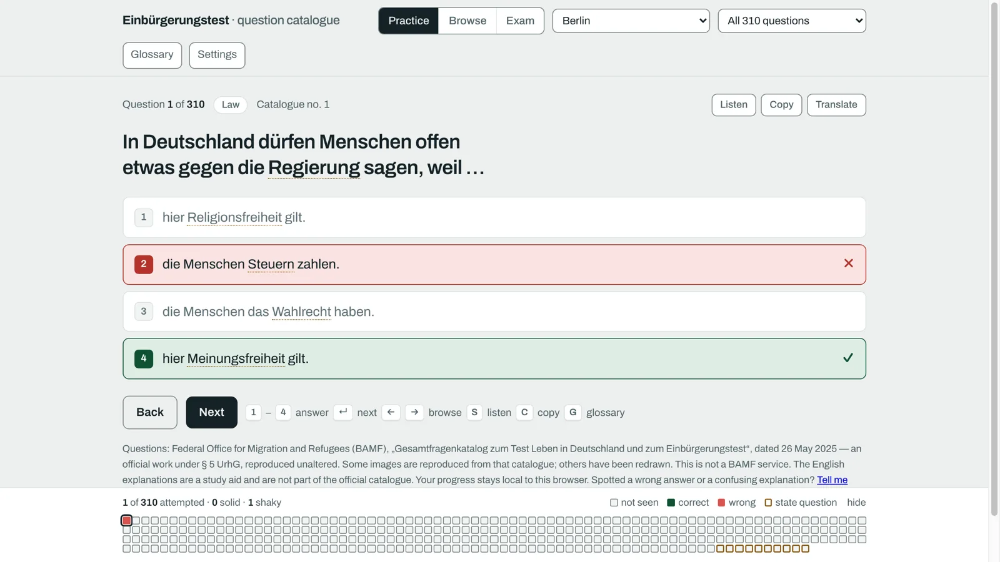
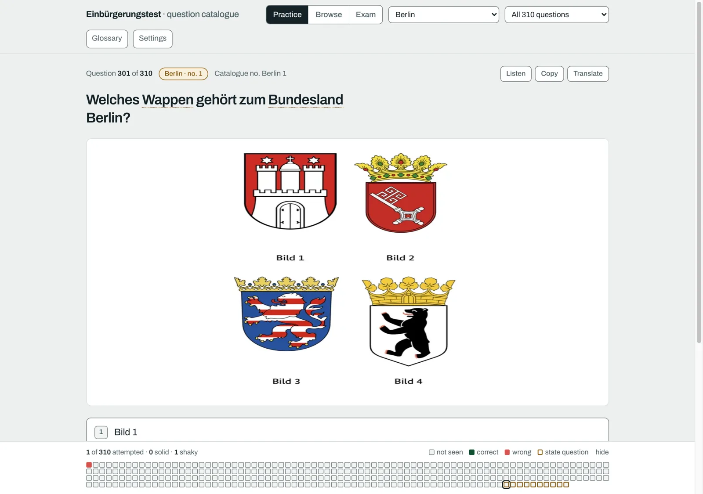
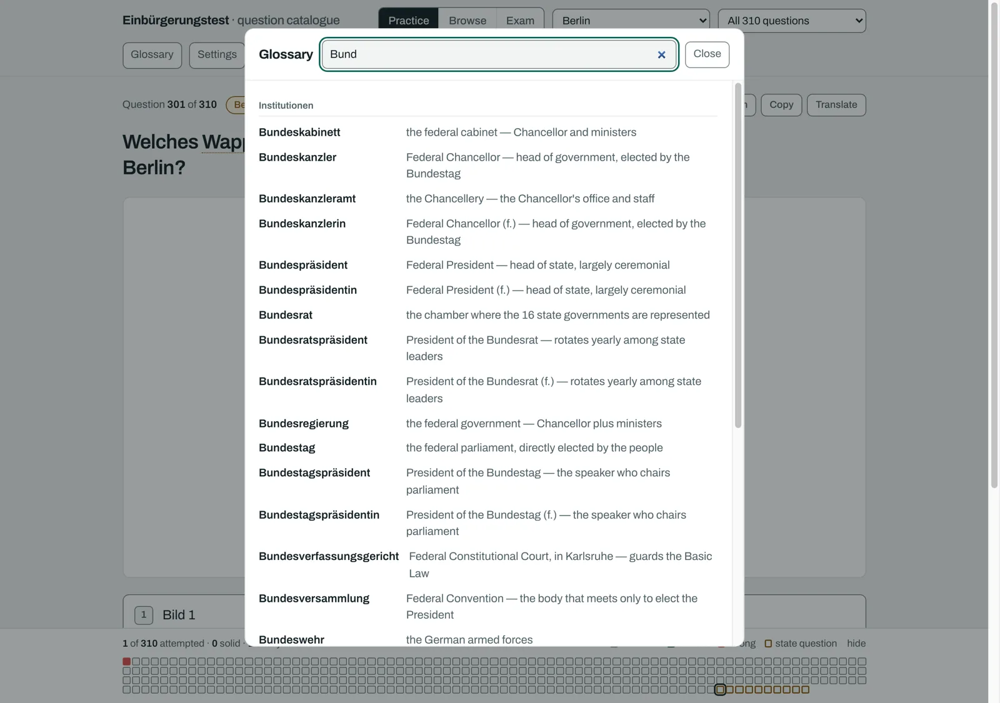
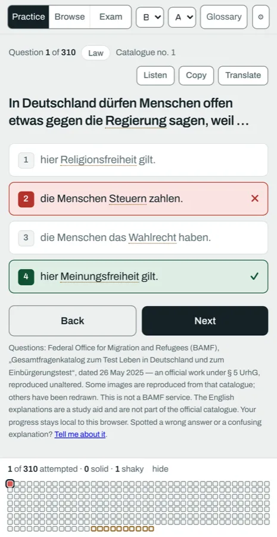

<div align="center">

# Einbürgerungstest

**All 460 questions of the official German citizenship test — with English explanations.**

No build step, no server, no account, no tracking. Open it and it works, including offline.

### [→ Open the app](https://jadrizk.github.io/einbuergerungstest-trainer/)


<a href="https://jadrizk.github.io/einbuergerungstest-trainer/">
  
</a>

</div>

> [!NOTE]
> Not a BAMF service and not officially endorsed. The questions are the official catalogue;
> the English explanations are a study aid and are not part of it.

The full official catalogue: **460 questions** — 300 general, plus 10 for each of the 16 federal
states. The exam you sit draws 33 of them.

---

## Three ways to study

| | |
| --- | --- |
| **Practice** | One question at a time with immediate feedback, tracking what you have already answered. Narrow it to questions you have never seen, or to ones you keep getting wrong. |
| **Browse** | Read straight through the catalogue without being quizzed. |
| **Exam** | 33 questions under real conditions: 30 general and 3 from your state, nothing marked until you finish. 17 correct is a pass. |

## While you study

- **English explanations.** Civic and legal terms in the German questions are underlined; hover
  or tap one for a plain-English gloss. 361 terms, matched in their inflected forms too — so
  *Ministerpräsidenten* is recognised, not just *Ministerpräsident*.
- **Read aloud.** Questions can be spoken by the browser's German voice, with a choice of voice
  and four reading speeds. Useful for the listening side of the language, and for terms whose
  pronunciation is not obvious from spelling.
- **Shuffle questions, shuffle answers.** Shuffling answers is the one that matters — it stops
  you memorising *"the third option"* instead of the actual answer, which is the classic way to
  pass a practice app and fail the exam.
- **Copy or translate** any question with one click, for looking something up elsewhere or
  pasting it into your own notes.
- **Pick your state** to get the right 10 regional questions.

<table>
<tr>
<td width="50%">
  
  <p align="center"><em>Picture questions, including all 16 states' coats of arms</em></p>
</td>
<td width="50%">
  
  <p align="center"><em>The glossary, searchable in German or English</em></p>
</td>
</tr>
</table>

## On your phone



Open the link and use **Add to Home Screen**. It then launches like an app and works with no
connection.

On a first visit it quietly caches all 38 question images in the background, so a randomly drawn
exam still has its pictures when you are underground. That is skipped if your browser reports a
metered or very slow connection.

Your progress is stored in your own browser (`localStorage`) and goes nowhere else.
**Reset progress** in Settings clears it.

<br clear="right">

## Privacy

The app makes no network requests of its own: no analytics, no tracking, no telemetry, no
backend. It fetches only its own files from its own origin — the typeface included, so no
visitor IP reaches Google.

One external touch is worth naming so it is not a surprise: each question offers a **Translate**
link, which opens Google Translate in a new tab, and only when you click it.

## Found a mistake?

[**Open an issue.**](https://github.com/JadRizk/einbuergerungstest-trainer/issues/new) Wrong
answers, confusing explanations and bad glossary entries are all worth reporting.

---

## How it is built

Plain static files, served straight from the repository root. No build step, no dependencies,
no bundler: `git push` is the deploy.

| | |
| --- | --- |
| `index.html` | The shell — markup only |
| `app.css` | All styling, and the self-hosted `@font-face` |
| `app.js` | The whole app, an ES module, ~600 lines |
| `data/questions.json` | The 460-question catalogue |
| `data/glossary.json` | 361 German→English terms, a study aid |
| `img/` | The 38 question images, fetched only when a question needs one |
| `font/` | Archivo variable, latin subset, self-hosted |
| `sw.js` | Service worker — offline support and caching |
| `source/` | The original inputs, for reference only |

The data is fetched at runtime rather than inlined, so a change to the styling does not make
returning visitors re-download the catalogue. First load is **95 KB** over the wire.

<details>
<summary><b>If you change something</b> — caching rules worth knowing first</summary>

<br>

`sw.js` serves the shell **network-first**, so a deploy reaches people on their next reload with
no cache-busting needed; bump `VERSION` in it when the shell changes.

`data/*.json` is **stale-while-revalidate**, so a catalogue revision arrives on the visit after
next.

Everything in `font/`, `img/` and `icon/` is **cache-first** and assumed immutable — **give a
file a new name if its bytes change**.

The icons in `icon/` are flat placeholders.

</details>

<details>
<summary><b>⚠️ Do not rebuild <code>data/glossary.json</code> from <code>source/</code></b></summary>

<br>

They are not the same thing, despite the names. The shipped `data/glossary.json` carries a `rx`
field per term — a match pattern with German word boundaries — and 89 of the 361 entries list
inflections that exist nowhere else:

```
Ministerpräsident → Ministerpräsidentinnen | Ministerpräsidenten | Ministerpräsidentin | Ministerpräsident
```

Those cannot be derived from the plain source file; they need German morphology. They also earn
their keep: of the 2,235 glossary matches across the catalogue, **542 are inflected forms**.

Regenerating `data/glossary.json` from `source/einbuergerungstest-glossar.json` would delete all
of that silently — no error, no crash, just terms quietly ceasing to underline.

</details>

## Source and licence

Questions and images come from the **Bundesamt für Migration und Flüchtlinge (BAMF)**,
„Gesamtfragenkatalog zum Test ‚Leben in Deutschland' und zum ‚Einbürgerungstest'", dated
**26 May 2025** — an official work under § 5 UrhG.

Licensing is split, because the exam content is not mine to license:

| | |
| --- | --- |
| Code and glossary | [MIT](LICENSE) |
| The typeface, Archivo | [SIL Open Font License 1.1](font/OFL.txt) |
| The catalogue and its images | [LICENSE-CONTENT.md](LICENSE-CONTENT.md) — their § 5 UrhG status, and the attribution and no-modification duties that come with reusing them |

**This is not a BAMF service** and carries no official endorsement. The English explanations are
a study aid and are not part of the official catalogue. The catalogue is revised from time to
time — check the date above against the current official version before trusting it, and sit the
real thing on the official materials.
